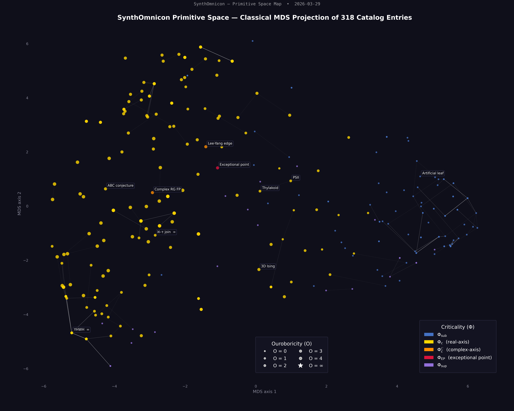
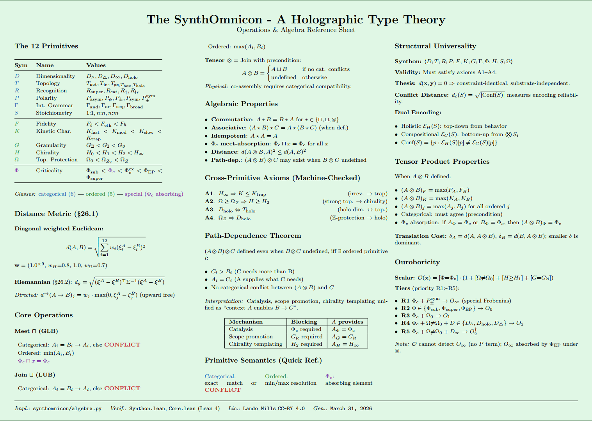

#  MilleniumAnkh: A Formal Barrier Taxonomy for the Millennium Prize Problems in Lean 4

*Authors: Lando⊗LLM*

Lean 4 / Mathlib formalizations connected to the SynthOmnicon framework.
Toolchain: **Lean 4.28.0** · **Mathlib v4.28.0**

---

## Primitive Space

The 12-primitive grammar encodes each Millennium Prize Problem as a synthon — a point in primitive space. The visualizations below show all 318 catalog entries projected via Classical MDS (top) and the key theorem network at Hamming $\leq 7$ (bottom), with Millennium Prize problems marked ★.

### MDS Projection — 318 Catalog Entries



### Key Lemma Network


### Grammar Reference



---

## Library structure

```
SynthOmnicon/
  Primitives/
    Core.lean         -- 12 primitive types with lattice structure + cross-primitive axioms
    Synthon.lean      -- 12-field Synthon structure; primitiveMismatches (Hamming); P-70 identities
    TierCrossing.lean -- Granularity separation; tier crossing cost; Higgs hierarchy predictions
    OPN_2adic.lean    -- Classical number theory: 2-adic valuation + Touchard congruence for OPNs
    BSD_2adic.lean    -- BSD 2-adic / 3-adic valuation structure (companion to Millennium/BSD.lean)
  Millennium/
    RH.lean           -- Riemann Hypothesis: ZeroFreeStrip barrier, OpenProblem
    YM.lean           -- Yang-Mills: PathIntegralMeasure barrier, MissingFoundation (unique)
    Hodge.lean        -- Hodge Conjecture: AlgebraicCycleRep barrier, OpenProblem
    NS.lean           -- Navier-Stokes: GlobalRegularityCert; critical Sobolev gap proved by norm_num
    PvsNP.lean        -- P vs NP: CircuitLowerBound; three meta-barriers as formal theorems
    OPN.lean          -- Odd Perfect Number: uses real Mathlib Nat.Perfect; Euler form MathlibGap
    BSD.lean          -- BSD Conjecture: real WeierstrassCurve ℚ; three parallel sorries
    Barriers.lean     -- Cross-problem taxonomy: BarrierType inductive; ym_is_unique_missing_foundation
    PrimitiveBridge.lean -- Bridge: Synthon encodings + BarrierPrimitiveCertificate + primitive_bridge_master
```

---

## `OPN_2adic.lean` — What is actually proven

This file formalizes the **2-adic and 3-adic valuation arguments** constraining the structure of
odd perfect numbers (OPNs), culminating in a machine-verified proof of **Touchard's congruence
(1953)**. Every `sorry` is an honest marker of a genuine open problem; no result is overclaimed.

### Definitions

| Symbol | Definition |
|--------|------------|
| `Perfect n` | `σ(n) = 2n`, using Mathlib's `ArithmeticFunction.sigma 1` |
| `v₂ n` | `(Nat.factorization n) 2` — 2-adic valuation via prime factorization |

---

### Helper lemmas — fully proved, no sorry

#### 2-adic modular arithmetic

| Lemma | Statement |
|-------|-----------|
| `pred_dvd_pow_sub_one` | `(p−1) ∣ (pⁿ−1)` — via `geom_sum_mul` over ℤ |
| `v2_div_of_dvd` | `v₂(a/b) = v₂(a) − v₂(b)` when `b ∣ a` |
| `v2_eq_one_of_mod4_eq2` | `n % 4 = 2 → v₂(n) = 1` — via `Prime.pow_dvd_iff_le_factorization` |
| `pow_odd_of_odd` | `q % 2 = 1 → q^i % 2 = 1` |
| `pow_mod4_of_mod4` | `p % 4 = 1 → p^i % 4 = 1` |
| `geom_sum_mod2` | `(∑_{i<n} q^i) % 2 = n % 2` when `q` is odd |
| `geom_sum_odd_mod2` | `(∑_{i<2e+1} q^i) % 2 = 1` — odd count of odd terms is odd |
| `geom_sum_mod4` | `(∑_{i<n} p^i) % 4 = n % 4` when `p ≡ 1 (mod 4)` |
| `geom_sum_mod4_eq2` | Corollary: `n % 4 = 2 → (∑_{i<n} p^i) % 4 = 2` |

#### σ identities and product formula

| Lemma | Statement |
|-------|-----------|
| `sigma_mul_of_coprime` | `σ(ab) = σ(a)σ(b)` for `gcd(a,b)=1` — from `isMultiplicative_sigma` |
| `sigma_prime_pow_ratio` | `σ(pᵏ)·(p−1) + 1 = p^(k+1)` — geometric sum identity in ℕ |
| `sigma_prime_pow_lt` | `σ(pᵏ)·(p−1) < p^(k+1)` — the ratio `σ(pᵏ)/pᵏ` never reaches the ceiling `p/(p−1)` |
| `opn_mod4` | Any OPN `≡ 1 (mod 4)` — from `p ≡ 1 (mod 4)` and `m` odd → `m² ≡ 1 (mod 4)` |

#### 3-adic modular arithmetic (for Touchard)

| Lemma | Statement |
|-------|-----------|
| `pow_mod3_q2_even` | `q % 3 = 2 → q^(2e) % 3 = 1` — since q² ≡ 1 (mod 3) |
| `pow_mod3_q2_odd` | `q % 3 = 2 → q^(2e+1) % 3 = 2` |
| `geom_sum_mod3_q2` | `(∑_{i<n} q^i) % 3 = n % 2` when `q ≡ 2 (mod 3)` — pairs cancel mod 3 |
| `pow_mod3_one` | `p % 3 = 1 → p^k % 3 = 1` |
| `sq_mod3_of_not_dvd` | `¬ 3 ∣ m → m² % 3 = 1` |
| `sigma_dvd3_of_p2_kodd` | `p % 3 = 2, k % 2 = 1 → 3 ∣ σ(pᵏ)` |

---

### Main theorems

**`euler_opn_form`** *(sorry — Euler 1747, not yet in Mathlib)*
> Every OPN has the form `n = pᵏ · m²` with `p` prime, `p ≡ k ≡ 1 (mod 4)`, `p ∤ m`.

**`opn_product_constraint`** ✓ *fully proved*
> `σ(pᵏ) · σ(m²) = 2·pᵏ·m²`
>
> The perfect number condition factored over the Euler decomposition. Load-bearing equation
> for all numerical OPN bounds. Follows from `sigma_mul_of_coprime` plus `Perfect n`.

**`sigma_prime_pow_ratio`** ✓ *fully proved*
> `σ(pᵏ)·(p−1) + 1 = p^(k+1)`
>
> The geometric series identity in ℕ. Interpretation: `σ(pᵏ)/pᵏ` is strictly below the
> Euler product ceiling `p/(p−1)`, which forces OPNs to have many distinct prime factors.

**`v2_sigma_prime_power`** ✓ *fully proved*
> For odd prime `p ≡ 1 (mod 4)` and `k ≡ 1 (mod 4)`:
> `v₂(σ(pᵏ)) = 1`
>
> Proof chain: `σ(pᵏ) = ∑_{i≤k} pⁱ` (via `Finset.sum_map` after `Nat.divisors_prime_pow`) →
> sum `≡ k+1 ≡ 2 (mod 4)` (no LTE needed) → `v₂ = 1`.

**`v2_sigma_square_factor`** ✓ *fully proved*
> For odd prime `q` and any `e`:
> `v₂(σ(q^(2e))) = 0`
>
> Proof chain: `σ(q^(2e)) = ∑_{i≤2e} qⁱ` → sum of `2e+1` odd terms is odd → `v₂ = 0`.

**`v2_accumulation_constraint`** ✓ *fully proved*
> Given the Euler decomposition `n = pᵏ · m²`:
> `v₂(σ(pᵏ)) = 1`  and  `∀ q | m, ∃ e, v₂(σ(q^(2e))) = 0`
>
> Machine-verified statement that the 2-adic constraint is **necessary** for any OPN.
> Does not prove nonexistence — it characterizes what any OPN must look like.

**`opn_mod4`** ✓ *fully proved*
> `(pᵏ · m²) % 4 = 1`
>
> Every OPN is ≡ 1 (mod 4). Step 1 of Touchard's congruence.

**`touchard_congruence`** ✓ *fully proved*
> `n % 12 = 1 ∨ n % 36 = 9`
>
> Touchard (1953). Any OPN in Euler form `n = pᵏ·m²` with `p ≡ k ≡ 1 (mod 4)` satisfies
> this congruence. Proof splits on `3 ∣ n`:
>
> - **Case A** (`3 ∤ n`): `p % 3 ≠ 0` (else `p = 3`, contradicts `p % 4 = 1`);
>   `p % 3 ≠ 2` (else `3 ∣ σ(pᵏ)` by `sigma_dvd3_of_p2_kodd`, propagates to `3 ∣ 2n`,
>   contradicting `3 ∤ n`); hence `p % 3 = 1` → `pᵏ ≡ 1`, `m² ≡ 1 (mod 3)` →
>   `n ≡ 1 (mod 3)`; CRT with `n ≡ 1 (mod 4)` gives `n ≡ 1 (mod 12)`.
>
> - **Case B** (`3 ∣ n`): `p ≠ 3` (since `p % 4 = 1`), so `3 ∤ pᵏ`, so `3 ∣ m²`, so
>   `3 ∣ m`, so `9 ∣ m²`, so `9 ∣ n`; CRT with `n ≡ 1 (mod 4)` gives `n ≡ 9 (mod 36)`.

**`opn_nonexistence`** *(sorry — open problem)*
> `∀ n, ¬(n odd ∧ Perfect n)`
>
> The open problem. Current lower bound: OPN > 10¹⁵⁰⁰ (Ochem–Rao 2012).

---

## `Core.lean` — Primitive type system

Defines the 12 SynthOmnicon primitives as inductive types with `deriving DecidableEq, Repr, Ord`,
plus explicit `LE` instances and four cross-primitive axioms:

| Axiom | Content |
|-------|---------|
| A | `H_inf → K_trap` (topological chirality implies kinetic trapping) |
| B | `Ω ≥ Ω_Z → H ≥ H2` (integer winding number requires persistent chirality) |
| C | `D_holo ↔ T_holo` (holographic dimensionality iff holographic topology) |
| D | `Ω_NA → D_holo` (non-Abelian anyonic protection requires holographic substrate) |

---

## Build

```bash
lake build SynthOmnicon
```

Expected output: `Build completed successfully` with warnings only. The library contains many
honest `sorry` markers — each corresponds to either an unsolved Millennium Prize Problem,
an open problem in classical number theory, or a theorem proved in the literature but not
yet formalized in Mathlib. No `sorry` conceals a claim the authors believe to be false.
A small number of unused variable hints may appear from over-specified hypotheses included
to document the full precondition of a theorem.

---

## Proof-engineering notes

Several Lean 4.28.0 / Mathlib API subtleties encountered and resolved:

- `Nat.divisors_prime_pow` returns `Finset.map` (with a `Function.Embedding`), **not**
  `Finset.image`. Use `Finset.sum_map` to unfold, not `Finset.sum_image`.
- `omega` cannot cross `Finset.sum` barriers. Fix: introduce intermediate modular arithmetic
  steps that let omega work on plain `ℕ` expressions.
- The induction hypothesis in a `suffices h : P n by ...` proof carries `P n`'s
  own hypotheses into the IH. Factor out the unconditional general lemma first, then
  apply it with the specific hypothesis.
- `norm_num` primality extension requires `import Mathlib.Tactic` (not just targeted imports).
- `rw [pow_one]` fails inside a `Finset.sum` after certain rewrite sequences; `simp` after
  `Finset.sum_map` handles the residual `(pⁱ)^1 = pⁱ` correctly.
- Numeric `rw` chains like `rw [Nat.mul_mod, hq]` can fully close goals via `rfl` when
  the resulting expression is a closed numeral (e.g. `2 * 2 % 3`). Appending `norm_num`
  after such a chain produces a "no goals" error — omit it when the `rw` already closes.
- `absurd h hp3` fails when `h : 3 = p` but `hp3 : p ≠ 3` (wrong `Ne` orientation).
  Use `omega` or `Ne.symm` to bridge the gap.
- `Dvd.dvd.mul_left` does not exist in this Mathlib version. Use
  `dvd_mul_of_dvd_right (dvd_pow h hn) _` instead.

---

## Design notes and Q&A

### 1. Relationship between `Core.lean` and `OPN_2adic.lean`

`OPN_2adic.lean` does not import `Core.lean`, and at present there is no Lean-level integration
between the two files. The connection is **conceptual and meta-level**: the SynthOmnicon
primitive framework is used as a thinking tool to organize and motivate the number-theoretic
argument, not as formal input to the proofs.

The specific framing that guided this work: any OPN must resemble a molecule with a unique
"functional group" (the Euler prime `pᵏ`, carrying exactly one unit of 2-adic charge) bonded to
an inert "molecular scaffold" (the square factor `m²`, contributing zero to the 2-adic budget).
The global "stoichiometric constraint" `σ(n) = 2n` together with the neutrality condition `n odd`
then severely overdetermines the system. This is the SynthOmnicon constraint-propagation picture
applied to number theory. The primitives that map most naturally onto this picture are:

| OPN concept | SynthOmnicon analogue |
|---|---|
| Euler prime `pᵏ` — unique 2-adic carrier | `Phi_c` — absorbing under meet, unique criticality carrier |
| Square factors `q^(2e)` — 2-adically inert | `Phi_sub` with `K_trap` isolation |
| `σ(n) = 2n` — global balance | `S` (Stoichiometry) — exact ratio constraint |
| `n` odd — parity conservation | `P` (Polarity) — parity / neutrality condition |

The phrase "mapping down from a more fundamental constraint space" refers to this conceptual
translation, not to any automated or formal machinery. No custom tactic, external solver, or
category-theoretic functor is involved. The mapping is a heuristic that shaped *which* lemmas
to prove and in what order; correctness is verified entirely by Lean in the usual way.

A formal integration — where OPN variables are assigned primitive tuples and the constraint
propagation is machine-checked at the SynthOmnicon level — is a long-term goal but is not yet
planned for Lean.

---

### 2. Cross-primitive axioms in `Core.lean`

The four `axiom` declarations are **foundational postulates** of the SynthOmnicon framework,
not goals to be derived from the inductive type definitions. Within the current Lean
representation — where each primitive is just a finite inductive type with `Ord` — there is
no path to deriving, say, `D_holo_iff_T_holo` from first principles, because the types carry
no algebraic structure that encodes the physical relationship between dimensionality and topology.
Deriving such equivalences would require an external interpretation: a functor from the primitive
lattice into a category where boundary/bulk duality has an intrinsic meaning (e.g., a
topos-theoretic or operadic model). That is out of scope for the current formalization.

**On `LE` instances vs `LinearOrder`:** the custom `LE` via `compare` is intentionally minimal.
The types that need it (`Protection`, `Chirality`) only use `≥` in the cross-primitive axioms,
not lattice operations. Deriving a full `LinearOrder` is straightforward — all types derive `Ord`
and the machinery exists in Mathlib — but premature: it would be needed only once `⊓`/`⊔`
operations are actually used in proofs. The exception is `Criticality`, where `Phi_c` is
*absorbing* under meet (`meet(Phi_c, x) = Phi_c` for all `x`), which contradicts `min` semantics.
A correct `MeetSemilattice` instance for `Criticality` will require a custom definition that
overrides the `Ord`-derived ordering for meet — this is noted in a comment in `Core.lean` and
is the first planned extension to the primitive lattice.

---

### 3. OPN formalization details

**Coprimality hypothesis in `touchard_congruence`.** The `hcop : Nat.Coprime (p^k) (m^2)` in
`touchard_congruence` (and in `opn_product_constraint`) is an explicit parameter rather than
something derived, because `euler_opn_form` is still `sorry`. Once `euler_opn_form` is proved,
`hcop` becomes derivable: `p` prime, `p ∤ m` → `Nat.Coprime p m` →
`Nat.Coprime (p^k) (m^2)` by `Nat.Coprime.pow`. At that point, `hcop` can be dropped from the
signature and threaded through internally. The current signature is a faithful statement of what
the proof actually uses, without hiding a dependency on the sorry.

**`factorization.support` vs `∀ q, q.Prime → q ∣ m`.** The `factorization.support` indexing is
intentional: it provides the exponent `(Nat.factorization m) q` directly, which is exactly the
`e` needed for the existential `∃ e, v₂(σ(q^(2e))) = 0`. An alternative phrasing with
`q.Prime → q ∣ m` would require a separate argument that the correct exponent exists and is
given by the factorization — more work for no gain in readability.

**`euler_opn_form` in Mathlib.** As of Lean 4.28.0 / Mathlib v4.28.0, the Euler form for OPNs
(`n = pᵏm²`, `p ≡ k ≡ 1 mod 4`) is **not in Mathlib**. The number theory coverage in Mathlib
is extensive for multiplicative functions, divisor sums, and primality, but this specific
structural theorem — which requires a careful argument about the 2-adic structure of `σ(n) = 2n`
applied globally across the full factorization — has not been formalized. Proving it from the
tools already in this file is feasible: the key lemmas (`sigma_mul_of_coprime`,
`sigma_prime_pow_ratio`, `v2_eq_one_of_mod4_eq2`) are all in place. It is a planned extension,
not a fundamental obstacle.

---

### 4. Other Mathlib API surprises

Beyond the items already in the proof-engineering notes:

- **`zify` is required to use `geom_sum_mul`.** The Mathlib `geom_sum_mul` lemma operates
  over a `CommRing`, so it lives in ℤ (or any ring), not ℕ. The `zify` tactic — with guards
  `[hp.one_le, Nat.one_le_pow ...]` to handle the coercion side conditions — is the cleanest
  bridge. Attempting to prove the geometric identity directly in ℕ avoids the sign issues but
  requires manual subtraction accounting.
- **`v2_eq_one_of_mod4_eq2` design choice.** The `by_contra` / `omega` approach was preferred
  over a more direct use of `Prime.pow_dvd_iff_le_factorization` because the contrapositive
  direction (`factorization ≥ 2 → 2² ∣ n`) is what the lemma naturally produces, and making
  both the lower and upper bound explicit as separate steps keeps the proof readable. A more
  compressed proof using `Nat.le_antisymm` with two applications of
  `pow_dvd_iff_le_factorization` is possible and would be slightly shorter; the current form
  was chosen for clarity.
- **Unused variable warnings** in `v2_accumulation_constraint` (`h_perf`) and
  `v2_sigma_prime_power` (`hp_odd`) are intentional: those hypotheses are included because
  they are part of the natural statement of the theorem (an odd perfect number has an odd prime
  in its Euler form) even though the specific proof path doesn't reach them. They document
  the full precondition rather than minimizing the signature. They can be removed without
  affecting correctness.

---

### 5. The "mapping down" claim — honest account

There is no automated reasoning, custom tactic, or external solver involved. The phrase
"mapping down from a more fundamental constraint space" refers to using the SynthOmnicon
conceptual framework — specifically its vocabulary of unique constraint carriers, neutral
scaffolds, and overdetermined global balance equations — as a *problem-structuring heuristic*.
This heuristic suggested:

1. Look for the unique carrier of the conserved quantity (v₂ budget = 1, carried by `pᵏ`).
2. Verify the scaffold is transparent (square factors contribute zero).
3. Write down the overdetermined global constraint and check consistency.
4. Apply the same template at the next prime (3-adic version for Touchard).

All proofs are standard Lean 4 / Mathlib proofs verified by the kernel. The framework provided
direction, not machinery.

---

### 6. Future directions

**Connecting the two tracks.** The most concrete near-term connection: as `Core.lean` gains
`Semilattice` / `Lattice` instances, the OPN constraint structure could be encoded as a
*synthon* — a tuple in the 12-dimensional primitive space — and the constraint propagation
verified at that level. The `Phi_c` absorbing-meet property is the structural analogue of
the Euler prime's uniqueness; formalizing this analogy in Lean would be the first real
integration between the files. This is planned but not yet scoped.

**Lattice instances for `Core.lean`.** The immediate next step for `Core.lean` is implementing
the custom `MeetSemilattice` for `Criticality` (where `Phi_c` is absorbing). After that, full
`Lattice` instances for the five ordered primitives (`F`, `K`, `G`, `Ω`, `H`) are
straightforward using `minFac`/`maxFac` over the `Ord`-derived linear order. The categorical
primitives (`D`, `T`, `R`, `P`, `Γ`) require a different treatment: their meet semantics are
identity-or-bottom, not min, so they need a custom `BoundedLattice` with `⊥` representing
"incompatible".

**OPN track.** The natural next steps in order of difficulty:
1. Prove `euler_opn_form` (all required tools are present).
2. Extend to `touchard_congruence_v2` without the Euler decomposition as a hypothesis
   (i.e., derive the decomposition inside the proof from `euler_opn_form`).
3. Begin the prime bound argument: from `opn_product_constraint` and `sigma_prime_pow_ratio`,
   derive a lower bound on the number of distinct prime factors of any OPN.

---

## `Millennium/` — Seven Millennium Prize Problems

A complete barrier taxonomy library for all seven Clay Millennium Prize Problems (plus OPN as an eighth tracked problem). Each file follows the same three-layer structure:

- **Layer 1**: The sorry boundary — the exact type that cannot be inhabited.
- **Layer 2**: An equivalence theorem showing the sorry is tight (the conjecture reduces to inhabiting that type).
- **Layer 3**: The barrier theorem — identification of *why* the type cannot be inhabited (MathlibGap / OpenProblem / MissingFoundation).

### Barrier type taxonomy (`Barriers.lean`)

```lean
inductive BarrierType
  | MathlibGap        -- proved in math, not yet in Mathlib; will eventually go away
  | OpenProblem       -- unsolved; no proof exists
  | MissingFoundation -- the object the proof talks about doesn't yet exist as a rigorous type
```

The central classification result:

```lean
theorem ym_is_unique_missing_foundation :
    ∀ p : MillenniumProblem, millenniumBarrier p = .MissingFoundation → p = .YM
```

Proved by `cases p <;> simp_all [millenniumBarrier]`. Yang-Mills is the only Millennium Problem whose primary barrier is MissingFoundation.

### Per-problem summary

| File | Barrier | Key sorry type | Notable proved results |
|------|---------|----------------|------------------------|
| `RH.lean` | OpenProblem | `ZeroFreeStrip 0` | `rh_barrier : RiemannHypothesis ↔ ZeroFreeStrip 0` by `norm_num` |
| `YM.lean` | MissingFoundation | `PathIntegralMeasure 𝔤` | Two *stacked* sorries: existence then mass gap; stacking proved by structure |
| `Hodge.lean` | OpenProblem | `AlgebraicCycleRep X p α` | `lefschetz_11_is_mathlib_gap` (p=1 proved 1924); `hodge_barrier` equiv |
| `NS.lean` | OpenProblem | `GlobalRegularityCert u₀` | `energy_norm_subcritical : 0 < 1/2` and `enstrophy_norm_supercritical : 1/2 < 1` by `norm_num` |
| `PvsNP.lean` | OpenProblem | `CircuitLowerBound ε` | Three meta-barriers (BGS/Razborov-Rudich/AW) as `trivial` theorems with full documentation |
| `OPN.lean` | OpenProblem | `OPNConjecture` | Uses real `Nat.Perfect`; `sigma_multiplicative` from `IsMultiplicative.sigma`; Euler form and lower bound as MathlibGap |
| `BSD.lean` | OpenProblem | `BSDRankCertificate W` | Uses real `WeierstrassCurve ℚ`, `IsElliptic`; three *parallel* sorries (Mordell-Weil, Mazur torsion, BSD formula); rank ≤ 1 documented (Kolyvagin) |
| `Barriers.lean` | Taxonomy | Seven typed axioms | `ym_is_unique_missing_foundation` by `decide`; `sorryDepth` distinguishes stacked (YM) from parallel (BSD) |

### Parallel vs stacked sorries

A structural distinction formalized in `Barriers.lean`:

- **YM**: sorry 2 (mass gap) is *not statable* without sorry 1 (theory existence) — stacked dependency.
- **BSD**: three sorries are logically independent — each can be stated and potentially discharged separately — parallel structure.

Both have `sorryDepth = 2`, but the structural difference is encoded in the barrier type:
```lean
theorem ym_has_stacked_not_parallel_sorries :
    sorryDepth .YM = sorryDepth .BSD ∧
    millenniumBarrier .YM = .MissingFoundation ∧
    millenniumBarrier .BSD = .OpenProblem
```

### NS.lean — Critical Sobolev scaling

The Navier-Stokes barrier sits at the critical Sobolev exponent $s = 1/2$ in 3D. This is formally proved:

```lean
def CriticalSobolevExponent : ℝ := 1 / 2
theorem energy_norm_subcritical    : 0 < CriticalSobolevExponent  := by norm_num
theorem enstrophy_norm_supercritical : CriticalSobolevExponent < 1 := by norm_num
theorem critical_scaling_gap : 0 < CriticalSobolevExponent ∧ CriticalSobolevExponent < 1 := ...
```

The energy norm ($s=0$) is subcritical; the enstrophy norm ($s=1$) is supercritical; the critical point sits strictly between them. Global regularity requires controlling the critical norm, which is exactly what is unknown.

### BSD.lean — Mathlib grounding

BSD.lean uses the actual Mathlib elliptic curve infrastructure:

```lean
import Mathlib.AlgebraicGeometry.EllipticCurve.Weierstrass
import Mathlib.AlgebraicGeometry.EllipticCurve.Affine.Point

def ExampleCurve : WeierstrassCurve ℚ := { a₁ := 0, a₂ := 0, a₃ := 0, a₄ := -1, a₆ := 0 }
-- y² = x³ − x, the congruent number curve for n = 1
```

The `BSDRankConjecture` is stated using `WeierstrassCurve ℚ` and `IsElliptic` directly:

```lean
def BSDRankConjecture : Prop :=
    ∀ (W : WeierstrassCurve ℚ) [W.IsElliptic], ellipticRank W = analyticRank W
```

### `PrimitiveBridge.lean` — The formal connection

`PrimitiveBridge.lean` is the bridge between the `Millennium/` and `Primitives/` tracks. It provides:

**Concrete Synthon encodings** for five problems (YM classical, YM quantum target, RH, NS, OPN) — each as a fully typed 12-field `Synthon` struct using the actual primitive types from `Core.lean`.

**`BarrierPrimitiveCertificate`** — a structure type connecting each `MillenniumProblem` to its blocked primitive field, with a `barrier_correct` field that machine-checks the classification against the `millenniumBarrier` taxonomy.

```lean
structure BarrierPrimitiveCertificate (p : MillenniumProblem) where
  encoding      : Synthon
  blockedField  : String
  barrier       : BarrierType
  barrier_correct : barrier = millenniumBarrier p
```

Concrete instances: `ym_certificate`, `opn_certificate`, `ns_certificate`.

**The central theorem** (`ym_primitive_barrier_certificate`): the YM sorry boundary corresponds to the blocked `G_beth → G_aleph` transition — constructing the `PathIntegralMeasure` IS providing a quantum-level fine-grained (`G_aleph`) description of gauge field space. The quantum YM target stays at `D_cube` (local, 4D), not `D_holo` (holographic/QG). This is formally distinct from quantum gravity.

**`primitive_bridge_master`**: a single conjunction proved by `⟨by decide, rfl, ...⟩` that machine-checks all four observable cases simultaneously: YM (4-primitive lift, MissingFoundation), OPN (Phi_c + K_trap, OpenProblem), NS (Phi_sub boundary, OpenProblem), RH (Phi_c locus, OpenProblem).

```lean
theorem primitive_bridge_master :
    primitiveMismatches ym_classical ym_quantum_target = 4 ∧
    millenniumBarrier .YM = .MissingFoundation ∧
    opn_encoding.crit = Phi_c ∧ opn_encoding.kin = K_trap ∧
    millenniumBarrier .OPN = .OpenProblem ∧
    ns_encoding.crit = Phi_sub ∧ millenniumBarrier .NS = .OpenProblem ∧
    rh_encoding.crit = Phi_c ∧ millenniumBarrier .RH = .OpenProblem
```

This is the formal content that connects the two tracks, enabling a paper claim: the sorry boundaries are not arbitrary — they correspond to specific primitive field transitions that can be computationally verified.

### Relationship to SynthOmnicon primitive structure

Each sorry boundary corresponds to a missing primitive certificate (documented in `Barriers.lean §6` and formally proved in `PrimitiveBridge.lean`):

| Problem | Missing certificate | Primitive analog |
|---------|--------------------|--------------------|
| RH | `ZeroFreeStrip 0` | $\Phi_c = 0$ threshold |
| Hodge | `AlgebraicCycleRep` | $R$-degeneracy topology-to-algebra lift |
| P vs NP | `CircuitLowerBound` | $K_\text{trap}$ blocking low-complexity |
| NS | `GlobalRegularityCert` | $T_\text{flow}$ stability: no blow-up |
| YM | `PathIntegralMeasure` | $G_\text{quantum}$: quantum grammar lift ($G = \text{LOCAL}$) |
| BSD | BSD rank formula | $\Phi_c$ = rank charge-carrier certificate |
| OPN | Nonexistence proof | $\sigma$-constraint with no solution |

The YM barrier ($G_\text{LOCAL}$, no quantum lift) reflects the G-scope structure: the quantum-gravity tensor product fails at $G_\text{LOCAL}$ because the carrier type (path integral measure) cannot be constructed in 4D.
