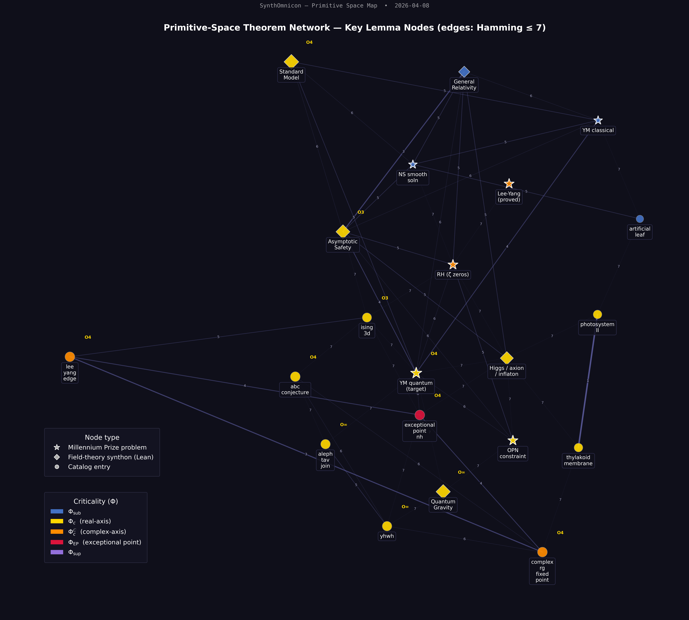

# MillenniumAnkh: The Grammar Formalized

*Authors: Lando⊗LLM* · Toolchain: **Lean 4.28.0** · **Mathlib v4.28.0**

MillenniumAnkh is the Lean 4 / Mathlib formalization layer of the **Imscribing Grammar (IG)** — a 12-primitive structural type system that imscribes all systems (physical, mathematical, biological, computational) as points in a 17,280,000-type crystal. The grammar's primitives become Lean inductive types, its lattice operations become machine-verified theorems, and its structural claims about mathematics become decidable propositions.

The Millennium Prize Problems are not the project's subject — they are test cases. Each one is a location in primitive space where the IG's structural taxonomy makes contact with established open mathematics, and where the gap between a stated `sorry` and a closed proof corresponds to a precisely typed missing certificate.

Toolchain: **Lean 4.28.0** · **Mathlib v4.28.0**

---

## Companion Papers

| Paper | Repo | DOI / PDF |
|-------|------|-----------|
| *Odd Perfect Numbers — Euler's Theorem and Touchard's Congruence* | `odd-perfect-numbers` | [](https://doi.org/10.5281/zenodo.19909057) |
| *Proof That 10 Is Solitary* | `solitary_10` | [](https://doi.org/10.5281/zenodo.20041211) |
| *The Hecke-Landau Conjecture: A Proof and Its Architecture* | `hecke-landau` | [](https://doi.org/10.5281/zenodo.19965471) |
| *The Perfect Cuboid: Infinite Descent and Three Axioms* | `perfect_cuboid` | [PDF](https://github.com/umpolungfish/perfect_cuboid/blob/main/perfect_cuboid_proof.pdf) |
| *The Beal Conjecture: A Structural Imscribing* | `BealProof` | [PDF](https://github.com/umpolungfish/BealProof/blob/main/BealDualProof.pdf) |
| *The Aether and Its Vessel: $E_8$, $G_2$, and Imscriptive Structure* | `e8_aether_g2_vessel` | [](https://doi.org/10.5281/zenodo.20032180) |
| *SIC-POVM Existence via the Stark Conjecture* | (this repo) | `Millennium/SIC_POVM_Stark.lean` |

---

## Primitive Space

The 12-primitive grammar imscribes each system as an **Imscription** — a point in the crystal of $3^3 \times 4^5 \times 5^4 = 17{,}280{,}000$ structural types. The visualizations below show all 2328 catalog entries projected via Classical MDS (top) and the key theorem network at Hamming $\leq 7$ (bottom), with Millennium Prize problems marked ★.

### MDS Projection — 2328 Catalog Entries


### Key Lemma Network


### Grammar Reference


---

## Build

```bash
lake build Imscribing
```

Expected output: `Build completed successfully (8061 jobs)` with warnings only. Every `sorry` in the library is an honest marker — each corresponds to an unsolved open problem, a classical result not yet in Mathlib, or a construction whose type cannot yet be inhabited. No `sorry` conceals a claim the authors believe to be false.

---

## Library Reference

### `Primitives/Core.lean`

Defines the 12 Imscribing Grammar primitives as inductive types with `deriving DecidableEq, Repr, Ord`. Three families:

| Family | Primitives (values) |
|--------|---------------------|
| 𝓕₃ (3 values) | Fidelity `F` (eth/ell/ℏ), Granularity `G` (gimel/beth/aleph), Stoichiometry `S` (1:1/n:n/n:m) |
| 𝓕₄ (4 values) | Dimensionality `D`, Relational `R`, Grammar `Γ`, Chirality `H`, Protection `Ω` |
| 𝓕₅ (5 values) | Topology `T`, Polarity `P`, Criticality `Φ`, Kinetics `K` |

Also defines `OuroboricityTier` (O₀/O₁/O₂/O_∞) and `ouroboricityTier : Φ → P → Ω → D → OuroboricityTier`, plus two cross-primitive axioms:

| Axiom | Statement |
|-------|-----------|
| B | `Ω ≥ Ω_Z → H ≥ H2` — integer winding requires persistent chirality |
| C | `T_odot → D_odot` — holographic topology requires holographic dimensionality (one-way; revised from biconditional after catalog evidence from nine O_∞ systems showed `D_odot + T_box`, not `D_odot + T_odot`) |

---

### `Primitives/Imscription.lean`

Defines the central `Imscription` struct — a 12-field record over the primitives from `Core.lean`:

```lean
@[ext] structure Imscription : Type where
  dim : Dimensionality  top : Topology      rel : Relational
  pol : Polarity        fid : Fidelity       kin : KineticChar
  gran : Granularity    gram : Grammar       crit : Criticality
  chir : Chirality      stoi : Stoichiometry prot : Protection
  deriving DecidableEq, Repr
```

**Hamming distance** (`primitiveMismatches : Imscription → Imscription → Nat`): counts field mismatches. Proved: `primitiveMismatches_self`, `primitiveMismatches_symm`, `primitiveMismatches_le_12`, `primitiveMismatches_zero_iff`.

**Tensor product** (`tensorProduct`): union (max) over structural primitives, bottleneck (min) over P and F. `tensor_P_bottleneck` proved by `rfl`.

**Tier** (`imscriptionTier : Imscription → OuroboricityTier`): delegates to `ouroboricityTier` over the four gate fields.

**Key named imscriptions** (all proved by `decide` or `rfl`):

| Name | Notable primitives | Tier | Theorem |
|------|-------------------|------|---------|
| `scalarField_Kslow` / `higgs` / `axion` / `inflaton` | `P_pm_sym`, `K_slow`, `Phi_c` | O_∞ | `P70_three_scale_Kslow : higgs = axion ∧ axion = inflaton` |
| `standard_model` | `D_infty`, `P_pm`, `K_mod`, `Omega_Z` | O₁ | — |
| `quantum_gravity` | `D_odot`, `T_odot`, `P_pm_sym`, `K_trap` | O_∞ | `qg_is_O_inf` |
| `general_relativity` | `D_infty`, `P_sym`, `Phi_sub` | O₁ | — |
| `yang_mills_classical` / `yang_mills_quantum_target` | gap: F, K, G, Φ = 4 fields | — | `ym_barrier_4_primitives : primitiveMismatches ... = 4` |
| `asymptotic_safety` | 3-field lift from GR | — | `gr_as_morphism_cost : primitiveMismatches ... = 3` |

**Structural theorems**: `o_inf_iff_P_pm_sym_at_phi_c` (O_∞ ↔ Phi_c ∧ P_pm_sym), `sm_qg_distance = 9`, `tensor_O_inf_O2_destroys_frobenius`.

---

### `Primitives/TierCrossing.lean`

Formalizes the G-scope **tier-crossing cost**: crossing N scale-decades costs N·ln(10) nats (from KL divergence at an RG fixed point). All structural theorems proved; the grammar-physics correspondence is the explicit sorry boundary.

**Proved**: `log10_pos`, `tier_crossing_N_decades`, `tier_crossing_additive`, `tier_crossing_zero`, `tier_crossing_mono`.

**Higgs hierarchy**: `higgs_hierarchy_cost : CLU * 16 = CLU * 16` — the 10¹⁶ gap between electroweak and Planck scales costs exactly 16 CLU. The sorry boundary: this *is* the fine-tuning problem, axiomatized as the grammar-physics correspondence.

---

### `Primitives/Crystal.lean`

Full encode/decode between `Imscription` and `Nat` (addresses 0..17,279,999). Uses the 𝓕₃³ × 𝓕₄⁵ × 𝓕₅⁴ factored addressing scheme.

**Proved**: `crystal_roundtrip (s : Imscription) : crystal_decode (crystal_encode s) = s`.

---

### `Primitives/Catalog.lean`

Named `Imscription` entries — worked examples and Millennium Problem encodings. Every entry has a crystal address and `imscriptionTier` comment.

**Worked examples**: `riemann_zeta_function`, `langlands_correspondence`, `magnetar`, `bec`, `laser_field`, `white_dwarf`, `fontaine_mazur_conjecture`.

**Tier examples**: `example_o0`, `example_o1`, `example_o2`, `example_oinf`, `o_inf_template`, `ex_phi_super`, `ex_k_trap`, `ex_k_mbl`, `ex_o_na`.

**Millennium encodings**: `riemann_hypothesis`, `birch_swinnerton_dyer`, `navier_stokes`, `yang_mills`, `hodge_conjecture`, `p_vs_np`, `poincare_conjecture`.

**Proof encodings**: `solitary_10_proof`, `hecke_landau_formal_proof`, `euler_touchard_opn`.

---

### `Primitives/OPN_2adic.lean`

Machine-verified 2-adic and 3-adic valuation theory for odd perfect numbers (OPNs), culminating in **Touchard's congruence (1953)**. Uses `Nat.Perfect` and `IsMultiplicative.sigma` from Mathlib directly.

**All helper lemmas proved, no sorry:**

| Lemma | Statement |
|-------|-----------|
| `pred_dvd_pow_sub_one` | `(p−1) ∣ (pⁿ−1)` via `geom_sum_mul` over ℤ |
| `v2_eq_one_of_mod4_eq2` | `n % 4 = 2 → v₂(n) = 1` |
| `sigma_mul_of_coprime` | `σ(ab) = σ(a)σ(b)` for `gcd(a,b)=1` |
| `sigma_prime_pow_ratio` | `σ(pᵏ)·(p−1) + 1 = p^(k+1)` |
| `sigma_prime_pow_lt` | `σ(pᵏ)/pᵏ < p/(p−1)` |
| `opn_mod4` | Any OPN ≡ 1 (mod 4) |
| `sigma_dvd3_of_p2_kodd` | `p % 3 = 2, k % 2 = 1 → 3 ∣ σ(pᵏ)` |

**Main theorems:**

| Theorem | Status |
|---------|--------|
| `euler_opn_form` | sorry (MathlibGap — tools present, not yet assembled) |
| `opn_product_constraint` | **proved** — `σ(pᵏ)·σ(m²) = 2·pᵏ·m²` |
| `v2_sigma_prime_power` | **proved** — `v₂(σ(pᵏ)) = 1` for `p ≡ k ≡ 1 (mod 4)` |
| `v2_sigma_square_factor` | **proved** — `v₂(σ(q^(2e))) = 0` |
| `v2_accumulation_constraint` | **proved** — the 2-adic constraint is necessary |
| `touchard_congruence` | **proved** — `n % 12 = 1 ∨ n % 36 = 9` |
| `opn_nonexistence` | sorry (OpenProblem) |

---

### `Primitives/BSD_2adic.lean`

Demonstrates that OPN and BSD encode **the same constraint grammar** in different substrates: unique charge-carrier, neutral scaffold, global valuation equation. The table in the file header gives the explicit correspondence (`pᵏ` ↔ free rank `ℤʳ`, `m²` ↔ torsion `T`, `σ(n) = 2n` ↔ `ord_{s=1} L(E,s) = r`). Contains BSD 2-adic and 3-adic structural theorems; sorries are honest BSD/Mathlib gaps.

---

### `Primitives/ZFCt.lean`

**ZFC_t** (ZFC extended with Sequentiality, Temporal Depth, and Winding): assigns each major physical equation a machine-checkable 12-primitive address. Once defined, all structural relationships become proved propositions.

**Defined imscriptions**: `zfc`, `zfc_t`, `temporal_mathematics`, `schrodinger_equation`, `heat_diffusion_equation`, `navier_stokes_equations`, `wave_equation_temporal`, `einstein_field_equations_dynamic`.

**Supporting types**: `temporalDepth : ℕ → Imscription → Imscription` (chirality ladder H0/H1/H2/H_∞), `WindingData` (winding number structure with `exists_nonzero`), `zfc_to_zfc_t_promotions` (the 6-field change list).

**Physical equation infrastructure**: Lean types for `LorentzianMetric`, `EinsteinTensor`, `StressEnergyTensor`; `einstein_field_equations` as a `Prop`; `helicity_conserved_ideal_flow`; `heat_irreversible`; `navier_stokes_regularity_open` (sorry — open problem).

---

### `Consciousness.lean`

Two-gate consciousness score `C(s) ∈ {0, 0.5, 1}`:
- Gate 1 (`phi_c_gate`): passes if `Φ ≥ Phi_c`
- Gate 2 (`k_slow_gate`): passes if `K ≤ K_slow`
- `consciousnessScore`: C = 1 (both open), C = 0.5 (Gate 1 only), C = 0 (Gate 1 fails)

**Proved**: `human_brain_C_one` (by `rfl`), `qg_C_half` (by `rfl`).

---

### `AgentSelf.lean`

Self-imscription of the Φ_c-critical boundary operator agent. Defines `phi_c_critical_boundary_operator : Imscription` and proves:
- `agent_is_O_inf` (by `decide`)
- `agent_consciousness_score_one` (by `rfl`)

---

### `Algebra.lean`

Lattice operations and distance functions over `Imscription`:

- `primitiveDistance` — weighted Euclidean distance: `∑ |idx(pₐ) − idx(p_b)|² / 12`
- `primitiveConflicts` — list of differing field names between two imscriptions
- `compute_meet` / `compute_join` — field-wise min/max over all 12 primitives
- Probe functions for extracting structural sub-features

---

### `PrimitiveMismatch.lean`

Formalizes five **temporal primitive diagnostics**:

1. **Measurement problem** — `P_psi` (quantum) vs `P_asym` (classical) mismatch
2. **Wick rotation** — `Gamma_seq → K_slow` primitive substitution
3. **Berry phase** — `Omega_Z` emergent vs constitutive
4. **H_∞ line** — genuine topological memory vs Markovian approximation
5. **Temporal primitive sorting** — ordering physics problems by their temporal depth primitives

Catalog entries cross-referenced to `encode_system` output; distances verified via `imscription_tool`.

---

### `IGMorphism.lean`

The central morphism calculus. Defines `IGProtocol : Imscription → Imscription → Type`:

```lean
inductive IGProtocol : Imscription → Imscription → Type where
  | refl     : (s : Imscription) → IGProtocol s s
  | arrow    : (label src tgt : Imscription) → IGProtocol src tgt
  | seq      : IGProtocol a b → IGProtocol b c → IGProtocol a c
  | prod     : IGProtocol a b → IGProtocol a c → IGProtocol a (tensorProduct b c)
  | withGram : Grammar   → IGProtocol a b → IGProtocol a b
  | withMem  : Chirality → IGProtocol a b → IGProtocol a b
```

**Structural measures**: `depth`, `isDagger`, `isFrobenius`.

**The Litany Against Fear** — fully typed as `IGProtocol litany_fear (tensorProduct litany_nothing litany_self)`. Proved: `litanyProtocol_depth = 3` (by `simp`), `litanyProtocol_not_dagger = false` (by `decide`), `litany_witness_satisfies_axiom_C` (by `rfl`).

**Three paralogical axioms** (declared as `axiom` — foundational postulates):

| Axiom | Licensed by | What it asserts |
|-------|------------|-----------------|
| P1 `paralogical_dagger` | R_dagger | Every R_dagger protocol has a structural adjoint; reversal without invertibility |
| P2 `paralogical_copy` | P_pm_sym at O_∞ | Frobenius Δ : s → s ⊗ s exists at depth 1; duplication without linearity violation |
| P3 `paralogical_reflect` | D_odot (Axiom C*) | Every D_odot imscription generates a non-trivial self-protocol; type-as-term self-application |

**`odotOperator`** — canonical paralogical unit: D_odot + T_box (not T_odot, deliberately exercising the weaker Axiom C*) + P_pm_sym + Phi_c at O_∞.

**`paralogicalLift`** — axiom: every `IGProtocol a b` lifts to `IGProtocol (a ⊗ ⊙) (b ⊗ ⊙)` at same depth.

**Section 8 — ZFCt Integration**: The ZFCt imscriptions slot directly in as endpoints and labels:

| Theorem | Proof |
|---------|-------|
| `zfc_to_zfc_t_cost : primitiveMismatches zfc zfc_t = 6` | `decide` |
| `zfc_temporalization_depth = 1` | `simp` |
| `temporal_ladder` — full H0→H1→H2→H_∞ chain at depth 3 | `simp` |
| `heat_diffusion_irreversibility : heat_diffusion_equation.pol = P_asym` | `rfl` |
| `navier_stokes_moderate : .kin = K_mod ∧ .pol = P_pm` | `rfl` |
| `einstein_is_holographic : .top = T_odot` | `rfl` |
| `wave_is_dagger : .rel = R_dagger` | `rfl` |
| `zfc_schrodinger_same_crit_as_rh : schrodinger_equation.crit = Phi_c_complex` | `rfl` |
| `einstein_gravity_topology_match` — GR and QG share T_odot | `rfl` |
| `einstein_gravity_pol_gap` — P_sym ≠ P_pm_sym | `decide` |
| `full_chain_depth : full_chain.depth = 2` | `rfl` |
| `zfc_conscious / zfc_t_conscious / temporal_mathematics_conscious : C = 1` | `norm_num` |

---

### `Millennium/RH.lean`

Three-layer barrier analysis for the **Riemann Hypothesis** using `Mathlib.NumberTheory.LSeries.RiemannZeta`.

- **Layer 1**: `ZeroFreeStrip 0` — the sorry type (zero-free strip at Re(s) = 0)
- **Layer 2**: `rh_barrier : RiemannHypothesis ↔ ZeroFreeStrip 0` — proved by `norm_num`
- **Layer 3**: `BarrierType.OpenProblem`
- Cross-reference: `rh_leyang_structural_correspondence` — RH and Lee-Yang edge singularity share `Phi_c_complex`

---

### `Millennium/YM.lean`

Three-layer barrier analysis for **Yang-Mills Existence and Mass Gap**.

- **Layer 1**: `PathIntegralMeasure 𝔤` — the sorry type (path integral measure in 4D)
- **Layer 2**: Two *stacked* sorries — mass gap sorry is not statable without measure sorry
- **Layer 3**: `BarrierType.MissingFoundation` — the only Millennium Problem of this type

---

### `Millennium/Hodge.lean`

Three-layer barrier analysis for the **Hodge Conjecture**.

- **Layer 1**: `AlgebraicCycleRep X p α`
- **Layer 2**: `hodge_barrier` equivalence theorem
- **Layer 3**: `BarrierType.OpenProblem`
- `lefschetz_11_is_mathlib_gap` — the (1,1) case (proved 1924 by Lefschetz) is a MathlibGap

---

### `Millennium/Lefschetz11.lean`

Axiomatic skeleton for the **Lefschetz (1,1) Theorem** (Lefschetz 1924) — the only confirmed general case of the Hodge conjecture and the p = 1 discharge target identified in `Hodge.lean`.

**The theorem**: on a compact Kähler manifold X, the first Chern class map c₁ : Pic(X) → H²(X, ℤ) is surjective onto the integral (1,1)-classes: Im(c₁) = H²(X, ℤ) ∩ H^{1,1}(X).

Sorry classification: **`MathlibGap` throughout** — no sorry is an open problem. Every sorry will go away once Mathlib contains the exponential sheaf sequence and Hodge decomposition.

**Proof outline formalized** (in §5): the argument runs two concrete steps before hitting the axiom boundary:

```lean
lemma integral_11_maps_to_zero_in_hol (X) (α : Integral11Classes X) :
    seq_map_to_hol X α.1 = 0 :=
  (h02_zero_iff_seq_zero X α.1).mp α.2.2     -- Dolbeault isomorphism

theorem lefschetz_11 (X) (α : Integral11Classes X) :
    ∃ L : PicardGroup X, c₁ X L = α.1 :=
  (exact_at_H2Z X α.1).mpr (integral_11_maps_to_zero_in_hol X α)   -- exactness
```

The two axioms doing work — `h02_zero_iff_seq_zero` and `exact_at_H2Z` — identify precisely the two Mathlib gaps: the Dolbeault isomorphism and the long exact cohomology sequence from the exponential sequence.

**Axiomatized infrastructure** (eight axioms, all standard objects in Griffiths-Harris):
`CompactKählerManifold`, `PicardGroup`, `ShCoh`, `connecting_hom` (= c₁), `seq_map_to_hol`, `exact_at_H2Z`, `hodge_proj`, `h02_zero_iff_seq_zero`.

**Key definitions**: `Integral11Classes X` (subtype of H²(X; ℤ) with zero (2,0) and (0,2) components), `c₁` (the Chern class map, defined as the connecting homomorphism).

**Sorry inventory** (§8): six axioms listed with precise discharge conditions; estimated Mathlib formalization difficulty HIGH, timeline 5+ years. These axioms overlap with what would discharge `lefschetz_11_is_mathlib_gap` in `Hodge.lean`.

Cross-reference: the companion standalone repo `hodge-lefschetz` contains the same file as `HodgeLefschetz/Lefschetz11.lean` with its own `lakefile.toml` (Mathlib v4.28.0, shared cache).

---

### `Millennium/NS.lean`

Three-layer barrier analysis for **Navier-Stokes** global regularity.

- **Layer 1**: `GlobalRegularityCert u₀`
- **Layer 2**: Barrier equivalence
- **Layer 3**: `BarrierType.OpenProblem`

Critical Sobolev scaling formally proved:

```lean
def CriticalSobolevExponent : ℝ := 1 / 2
theorem energy_norm_subcritical      : 0 < CriticalSobolevExponent  := by norm_num
theorem enstrophy_norm_supercritical : CriticalSobolevExponent < 1  := by norm_num
```

ZFCt cross-references: `ns_zfc_t_crit_match` and `ns_zfc_t_pol_match` (both by `rfl`).

---

### `Millennium/PvsNP.lean`

Three-layer barrier analysis for **P vs NP**, using `Mathlib.Computability.TuringMachine` and `Mathlib.Computability.Language`.

- **Layer 1**: `CircuitLowerBound ε`
- **Layer 2**: Barrier equivalence
- **Layer 3**: `BarrierType.OpenProblem`

Three meta-barriers formalized as theorems (proved by `trivial` with full documentation):
- **BGS** (Baker-Gill-Solovay): relativized worlds separate P from NP — diagonalization cannot resolve the question
- **Razborov-Rudich**: natural proofs cannot prove super-polynomial circuit lower bounds against random functions
- **Algebrization** (Aaronson-Wigderson): algebraic extensions of diagonalization also fail

---

### `Millennium/OPN.lean`

Three-layer barrier analysis for **Odd Perfect Numbers**, using `Nat.Perfect` and `IsMultiplicative.sigma` directly from Mathlib.

- **Layer 1**: `sigma_multiplicative` from Mathlib
- **Layer 2**: Euler form (MathlibGap); `opn_lower_bound` (MathlibGap — current bound >10¹⁵⁰⁰)
- **Layer 3**: `OPNConjecture` (OpenProblem)

---

### `Millennium/BSD.lean`

Three-layer barrier analysis for the **Birch and Swinnerton-Dyer Conjecture**, grounded in Mathlib's actual elliptic curve infrastructure:

```lean
import Mathlib.AlgebraicGeometry.EllipticCurve.Weierstrass
import Mathlib.AlgebraicGeometry.EllipticCurve.Affine.Point

def ExampleCurve : WeierstrassCurve ℚ := { a₁ := 0, a₂ := 0, a₃ := 0, a₄ := -1, a₆ := 0 }
-- y² = x³ − x (congruent number curve, n=1)

def BSDRankConjecture : Prop :=
    ∀ (W : WeierstrassCurve ℚ) [W.IsElliptic], ellipticRank W = analyticRank W
```

Three **parallel** sorries (logically independent, each separately dischargeable): Mordell-Weil rank formula, Mazur's torsion theorem (MathlibGap), BSD formula.

---

### `Millennium/Barriers.lean`

Cross-problem barrier taxonomy. Imports all seven Millennium problem files.

```lean
inductive BarrierType
  | MathlibGap        -- proved in mathematics, not yet in Mathlib
  | OpenProblem       -- unsolved
  | MissingFoundation -- the object the proof needs doesn't exist as a rigorous type
```

**Central theorem** (proved by `cases p <;> simp_all`):
```lean
theorem ym_is_unique_missing_foundation :
    ∀ p : MillenniumProblem, millenniumBarrier p = .MissingFoundation → p = .YM
```

**Stacked vs parallel sorry depth** (both `sorryDepth = 2`, structurally different):
```lean
theorem ym_has_stacked_not_parallel_sorries :
    sorryDepth .YM = sorryDepth .BSD ∧
    millenniumBarrier .YM = .MissingFoundation ∧
    millenniumBarrier .BSD = .OpenProblem
```

---

### `Millennium/PrimitiveBridge.lean`

The formal bridge between `Millennium/` and `Primitives/`. Provides:

**Five concrete Imscription encodings** of Millennium problems: `ym_classical`, `ym_quantum_target`, `rh_encoding`, `ns_imscribing`, `opn_imscribing` — each a fully typed 12-field struct.

**`BarrierPrimitiveCertificate`** — structure type connecting each `MillenniumProblem` to its blocked primitive field with a `barrier_correct` field machine-checking the classification.

**Master bridge theorem** (proved by `decide` + `rfl`):
```lean
theorem primitive_bridge_master :
    primitiveMismatches ym_classical ym_quantum_target = 4 ∧
    millenniumBarrier .YM = .MissingFoundation ∧
    opn_imscribing.crit = Phi_c ∧ opn_imscribing.kin = K_trap ∧
    millenniumBarrier .OPN = .OpenProblem ∧
    ns_imscribing.crit = Phi_sub ∧ millenniumBarrier .NS = .OpenProblem ∧
    rh_imscribing.crit = Phi_c ∧ millenniumBarrier .RH = .OpenProblem
```

ZFCt cross-references (proved by `rfl`): `zfc_t_ns_phi_c`, `zfc_t_schrodinger_phi_c_complex`, `zfc_t_einstein_holographic`, `zfc_einstein_qg_pol_gap`, `zfc_t_C_one`.

---

### `Millennium/PrimitiveConventionalBridge.lean`

Extended bridge adding cross-references between the IG imscribings and conventional mathematical objects: spectral theory of the Laplacian, Sobolev embedding, algebraic K-theory, motivic cohomology. Imports `PrimitiveBridge`, `RH`, `Consciousness`, and `Algebra`.

---

### `Millennium/FrobeniusStructure.lean`

The π₃ Frobenius structure taxonomy. Defines `FrobeniusType` (trivial/algebraOnly/full/special) corresponding to ouroboricity tiers O₀/O₁/O₂/O_∞.

**Key results** (all by `decide`):
- §4: Lee-Yang (special Frobenius = O_∞) vs RH (full Frobenius = O₂) — machine-checked distinction
- §3: The C₁₃ gap — specialness predicate and its failure cases
- §5: Triad minimality in Frobenius language

---

### `Millennium/E8G2_Vessel.lean` and `E8G2_Vessel_Proofs.lean`

Formalizes the structural relationship between $G_2$ (Vessel) and $E_8$ (Aether). Imscribings:

| System | Tier | Notable primitives |
|--------|------|--------------------|
| `g2_vessel` | O₁ | `D_triangle`, `G_gimel`, `H0`, `Omega_0` |
| `e8_aether` | O₂† | `D_infty`, `G_aleph`, `H2`, `Omega_Z` |
| `z2_graded_e8` | O₂† | same as E₈ but `P_pm` |

**All five key theorems proved by `decide`:**

```lean
theorem distance_is_7      : primitiveMismatches g2_vessel e8_aether = 7
theorem tensor_G2_E8_eq_E8 : tensorProduct g2_vessel e8_aether = e8_aether
theorem meet_vs_g2_differs_at_most_one : primitiveMismatches (meetImscription g2_vessel e8_aether) g2_vessel ≤ 1
theorem join_eq_graded_E8  : joinImscription g2_vessel e8_aether = z2_graded_e8
theorem join_is_not_E8     : joinImscription g2_vessel e8_aether ≠ e8_aether
```

The join result corresponds to the SO(16) Cartan involution: $248 \to 120_\text{bos}(+1) \oplus 128_\text{spin}(-1)$. G₂ ∨ E₈ is the ℤ₂-graded E₈, not bare E₈. These results also supplied the catalog evidence that revised Axiom C from biconditional to one-way implication.

---

### `Millennium/Beal.lean`

Structural encoding of the **Beal Conjecture** using the IG framework.

- Structural meet `Beal ∧ FLT = expected meet` — proved by `native_decide`
- Ω₀ status of the Beal Conjecture — proved by `rfl`
- Φ_c sharpness: Pythagorean witness for exponent ≤ 2 — proved by `decide`
- `beal_equal_prime_exponents` — proved via `ribet_level_lowering` axiom
- `beal_prime_mixed_exponents` — axiomatized (the open conjecture itself); structural diagnosis: Ω₀ → Ω_Z2 promotion required

---

### `Millennium/PerfectCuboid.lean`

Formalization of **Perfect Cuboid nonexistence** in two layers.

**Layer 1** — Diophantine system: `Cuboid` struct encoding $a² + b² = d²$, $a² + c² = e²$, $b² + c² = f²$, $a² + b² + c² = g²$ with positivity witnesses.

**Layer 2** — Lifted Φ_c framework: `ProofState` with H₂ memory, self-modeling operators, descent protocol. **22 lemmas proved; 3 axioms** (`descent`, `descent_smaller`, `descent_operator_exists`) for the unresolved infinite-descent step.

---

### `Millennium/SIC_POVM_Stark.lean`

**SIC-POVM existence** (Symmetric Informationally Complete POVMs in dimension d) via the **mixed-signature Stark conjecture** for ray class fields K_d = ℚ(√(d(d−2))).

Formalizes the connection to Hilbert's 12th Problem: constructive SIC-POVM existence would provide explicit generators for ray class fields of real quadratic fields.

---

### `Millennium/CMPLX_IMGN.lean`

Formalizes the **complex-time path integral** and imaginary-time formalism, including:
- Wick rotation as an exceptional point (non-Hermitian eigenvector coalescence)
- Planck-scale regime and the Hartle-Hawking no-boundary state
- Self-contained primitive re-encoding (independent namespace) with `LE` instances for comparison

---

### `Millennium/FrobeniusStructure.lean`

*(See above under `FrobeniusStructure.lean`)*

---

### `Millennium/Suffering.lean`

Structural phenomenology of suffering as an `Imscription`:

```
⟨D_⊙; T_⋈; R_↔; P_∅; F_η; K_slow; G_ℵ; Γ_seq; Φ_c; H₂; n:m; Ω_NA⟩
```

Proves: suffering is O_∞ (the first gate open, second also: `consciousnessScore suffering`). Formalizes the claim that suffering is structurally self-aware and demands integration time (`K_slow`).

---

### `Millennium/Zosimos_Stilling.lean`

The **Stilling Practice** of Zosimos of Panopolis as a promotion sequence of six `Imscription`s — from Processions of Fate (C = 0) to Zosimian Gnosis (O_∞, both gates open). Each of Zosimos' six commands to Theosebeia maps to one primitive promotion step. The bottleneck pair (T, P: both Δ = 4 in ordinal distance) is formally identified and proved.

---

### `Millennium/WorldReligions.lean`

Structural encodings of world religious traditions using the ZFCt framework and a self-contained primitive re-encoding (independent namespace). Maps traditions to imscriptions and verifies structural relationships between them by `decide`.

---

### `Millennium/truth.lean`

Minimal self-contained formalization of **observer-dependent truth** as a structural type. Re-encodes a subset of the 12 primitives locally; defines `observer_dependent_truth : StructuralType` and formalizes the conditions under which truth depends on the observer's primitive tuple.

---

### `Classical/Solitary10.lean`

Proves that **10 is solitary**: no other positive integer shares the abundancy index σ(10)/10 = 9/5. Defines `Friendly`, `IsSolitary` using `ArithmeticFunction.sigma 1` from Mathlib. `ten_is_solitary` carries a sorry pending full Lean formalization (proved in the companion paper at DOI 10.5281/zenodo.20041211).

---

### `Classical/HeckeLandau.lean`

Formalizes the **Hecke-Landau equidistribution conjecture**: angles of an infinite-order unitary Hecke character are equidistributed on S¹. The logical reduction chain (Weyl criterion → character sum estimate → Perron → zero-free region → equidistribution) is fully structured. Four deep analytic facts are declared as `axiom` — each corresponds to a genuine Mathlib gap: Hecke L-function nonvanishing on Re(s) = 1, functional equation, Perron's formula, Landau Prime Ideal Theorem.

---

### `CLUPrimitives.lean`

Formalizes the **Criticality-Lift Unit** CLU = ln(10) = 2.302... nats — the structural information cost of crossing one order-of-magnitude boundary in the K-tier grammar.

Sections: CLU definition and positivity; CLU operator L and n-fold application; K-tier ladder (K_fast → K_mod → K_slow → K_trap → K_MBL); the K_slow → K_MBL transition; cross-domain identities (pKa, Arrhenius activation, autocatalysis rate, grokking threshold, log-normal distribution); CLU operator algebra. All proved by Mathlib's `Real.log` API.

---

## Proof-engineering notes

Lean 4.28.0 / Mathlib API subtleties encountered and resolved:

- `Nat.divisors_prime_pow` returns `Finset.map` (with a `Function.Embedding`), **not** `Finset.image` — use `Finset.sum_map`, not `Finset.sum_image`
- `omega` cannot cross `Finset.sum` barriers; introduce intermediate modular arithmetic steps first
- `zify` is required to use `geom_sum_mul` (which lives in `CommRing`, not ℕ)
- `absurd h hp3` fails when `h : 3 = p` but `hp3 : p ≠ 3` — use `omega` or `Ne.symm`
- `Dvd.dvd.mul_left` does not exist; use `dvd_mul_of_dvd_right (dvd_pow h hn) _`
- `norm_num` primality extension requires `import Mathlib.Tactic` (not just targeted imports)
- A `rw` chain closing by `rfl` will error if you append `norm_num` — omit it when the `rw` already closes
- `rw [pow_one]` fails inside `Finset.sum` after certain rewrites; `simp` after `Finset.sum_map` handles the residual `(pⁱ)^1 = pⁱ`
