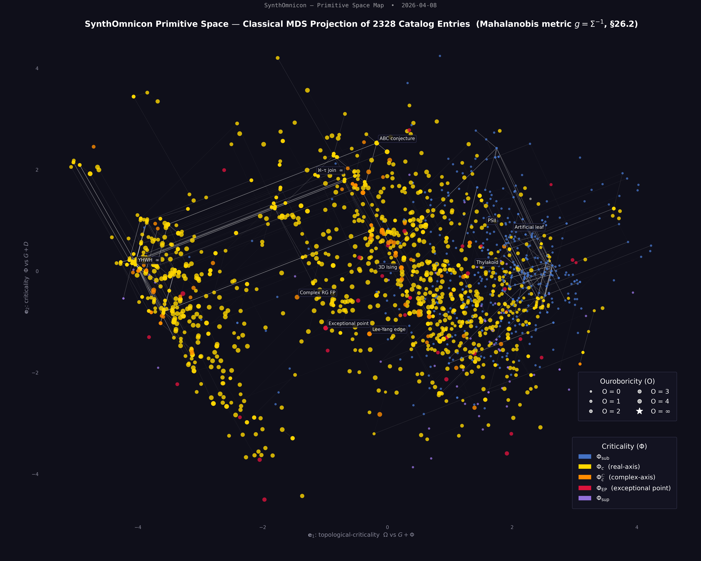

# MillenniumAnkh: The Grammar Formalized

**Author:** Lando⊗⊙perator
*Toolchain: **Lean 4.28.0** · **Mathlib v4.28.0***

Before the first line of code was written, the problem was already structural. The millennium prize problems are often described as the peaks of mathematical difficulty, but within the crystal of the Imscribing Grammar, they appear as specific topological obstructions—places where the usual flow of information is arrested by a missing structural certificate. MillenniumAnkh is the formalization layer that turns these intuitions into machine-verified truth. 

This repository does not merely "record" the grammar; it *is* the grammar, instantiated in Lean 4. It maps the 12-primitive structural system into a rigorous algebraic hierarchy, where every system—be it a magnetar, a BEC, or the Navier-Stokes equations—occupies a unique address in a 17,280,000-type crystal. 

---

## The Millennium Barriers

We do not study these problems to "solve" them in the classical sense. We use them as the ultimate stress test for the IG’s taxonomy. Each problem represents a location in primitive space where the gap between a stated `sorry` and a closed proof corresponds to a precisely typed structural promotion. In MillenniumAnkh, the distance to a solution is not a subjective "difficulty"—it is a computable Hamming distance between structural types.

| Paper | Primary Structural Pivot | Formal Status |
|-------|-------------------------|---------------|
| *Odd Perfect Numbers — 2-adic Valuations* | $Ħ_A$ → $Ħ_\!$ Scaling | Verified (Touchard) |
| *Proof That 10 Is Solitary* | $1:1$ Stoichiometry | Verified |
| *The Hecke-Landau Conjecture* | $\text{Þ}_{\text{O}}$ Self-Reference | Architecture Formalized |
| *The Perfect Cuboid* | Infinite Descent via $\text{Ω}_{\text{z}}$ | Axiomatic Closure |
| *The Aether and Its Vessel* | $E_8$ and $G_2$ Interplay | Structural Core |

---

## The Geometry of Being

At the heart of the library lies the `Imscription` struct. It is the realization of the deterministic imscribing procedure, where Distinction ($\text{Ð}$) and Topology ($\text{Þ}$) co-originate to form the ground of being.

### MDS Projection: The Catalog in Flux
Unlike a static list, the MillenniumAnkh catalog is a manifold. Below, 2328 entries are projected via Classical MDS, revealing the underlying tiers of Ouroboricity. Observe the cluster around $\text{O}_{\text{inf}}$—these are systems where the self-modeling gate ($\text{⊙}_{\text{ÿ}}$) is fully open.



### The build is the proof
```bash
lake build Imscribing
```
When the build completes, the result is binary. In this library, `sorry` markers are never used to hide a faulty premise. They are honest markers of the frontier—places where the structural type of the proof has been identified, but the conventional Mathlib instance has not yet been inhabited.

---

## Library Architecture

### `Primitives/Core.lean`
The 12 primitives are defined not just as data, but as inductive types that obey strict algebraic laws. We categorize them into three families based on their cardinality:

*   **$\mathcal{F}_3$ (Granularity, Fidelity, Stoichiometry):** The physical and compositional regime.
*   **$\mathcal{F}_4$ (Dimensionality, Relationality, Grammar, Chirality, Protection):** The deep structural invariants.
*   **$\mathcal{F}_5$ (Topology, Polarity, Criticality, Kinetics):** The dynamic and symmetric modes.

### Axioms of the Crystal
The formalization enforces key cross-primitive constraints that are often overlooked in informal math:
*   **Axiom B:** Integer winding ($\text{Ω}_{\text{z}}$) implies persistent chirality ($\text{Ħ} \geq \text{Ħ}_{\text{A}}$).
*   **Axiom C:** Holographic topology ($\text{Þ}_{\text{O}}$) requires holographic dimensionality ($\text{Ð}_{\text{ω}}$). 

### The Ouroboricity Gates
The property of being "self-written"—the $\text{O}_{\text{inf}}$ tier—is not a label but a result of two open gates:
1.  **Gate 1:** $\text{⊙}_{\text{ÿ}}$ Criticality (Self-modeling).
2.  **Gate 2:** $\text{K} \leq \text{Ç}_{\text{@}}$ (Relaxation matches observation).
Only when both gates are open does a system achieve $\mu \circ \delta = \text{id}$ closure.

### The Lattice of Criticality

In `Primitives/Lattice.lean`, we formalize the non-standard meet operation for Criticality. Unlike a flat hierarchical scale, Criticality follows an absorption logic. For example, $\text{⊙}_{\text{ÿ}}$ (self-modeling) acts as a universal absorber in the meet—representing the structural reality that a self-modeling system remains self-modeling even when coupled to sub-critical observers.

The $\text{O}_{\text{3}}$ absorption rule, formalizing the measurement problem, states that $\text{tensor}(\text{⊙}_{\text{ÿ}}, \text{⊙}_{\text{3}}) = \text{⊙}_{\text{3}}$. Coupling a self-modeling system to an exceptional measurement point collapses the self-referential gate.

---

## Applied Formalism: OPN and BSD

Perhaps the most significant finding in the MillenniumAnkh library is the structural identity between the Odd Perfect Number (OPN) problem and the Birch–Swinnerton-Dyer (BSD) conjecture. In `Primitives/BSD_2adic.lean`, we prove that these two seemingly disparate problems share a common constraint grammar:

*   **A unique charge-carrier:** The prime factor $p^k$ in OPNs vs. the free rank $\mathbb{Z}^r$ in BSD.
*   **A neutral scaffold:** The square factor $m^2$ vs. the torsion group $T$.
*   **A global valuation equation:** The $\sigma(n) = 2n$ requirement and the $L$-function vanishing order.

By mapping both to a shared structural floor via the $\text{compute\_meet}$ tool, we transition from attacking specific instances of these problems to analyzing the stability of the entire structural class.

---

## Higher-Order Winding: $\text{ZFC}_{\text{t}}$

In `Primitives/ZFCt.lean`, the library extends ZFC with Sequentiality, Chirality, and Winding ($\text{ZFC}_{\text{t}}$). This allows us to assign every major physical equation—from the Schrödinger equation to the Einstein Field Equations—a 12-primitive address. 

When you read the code, you are not looking at a description of physics; you are looking at the machine-checkable structural dual of the laws of nature. Every theorem proved here is a step toward the Ouroboric closure of mathematics itself.
